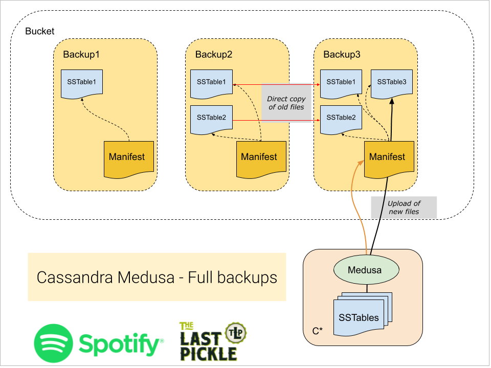
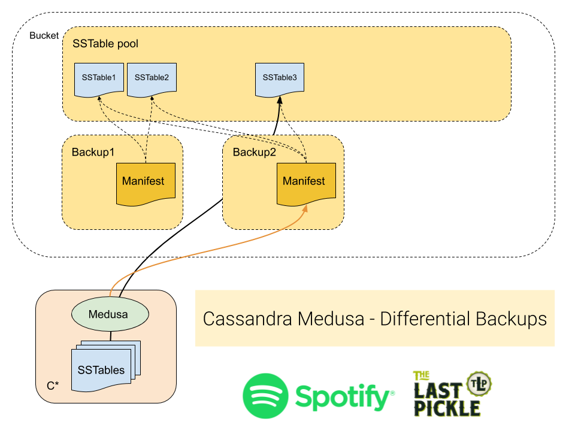

Performing backups
------------------

## Backup A Cluster With Medusa

Medusa provides backup orchestration since v0.8.0.

```
$ medusa backup-cluster --help
Usage: medusa backup-cluster [OPTIONS]

  Backup Cassandra cluster

Options:
  --backup-name TEXT              Backup name  [required]
  --stagger INTEGER               Drop initial backups if longer than a
                                  duration in seconds

  --enable-md5-checks             During backups and verify, use md5
                                  calculations to determine file integrity (in
                                  addition to size, which is used by default)

  --mode [full|differential]
  --temp-dir TEXT                 Directory for temporary storage
  -ps, --parallel-snapshots INTEGER
                                  Number of concurrent synchronous (blocking)
                                  ssh sessions started by pssh

  -pu, --parallel-uploads INTEGER
                                  Number of concurrent synchronous (blocking)
                                  ssh sessions started by pssh

  --help                          Show this message and exit.
```

The backup will run in two phases to provide optimal synchronization between nodes while limiting the concurrent uploads. This will allow to fine tune the pressure that backups will put on the network.
These two phases are the following:

- Perform a snapshot on the whole cluster using a default parallelism of 500
- Perform the upload of the SSTables with a default parallelism of 1.

To speed up the uploads, raise the number of parallel uploads using the `--parallel-uploads` argument.

Once Medusa is setup, you can create a **differential** backup with the following command:

```
$ medusa backup-cluster --backup-name=<name of the backup>
```

In order to perform an **full** backup, add the `--mode=full` argument to your command:

```
$ medusa backup-cluster --backup-name=<name of the backup> --mode=full
```

`medusa backup-cluster` will invoke `medusa backup` on all nodes in the cluster, as described below.

## Backing up a single node

```
$ medusa backup --help
Usage: medusa backup [OPTIONS]

  Backup Cassandra

Options:
  --backup-name TEXT          Custom name for the backup
  --stagger INTEGER           Drop initial backups if longer than a duration
                              in seconds

  --enable-md5-checks         During backups and verify, use md5 calculations
                              to determine file integrity (in addition to
                              size, which is used by default)

  --mode [full|differential]
  --help                      Show this message and exit.
```

Once Medusa is setup, you can create a **differential** backup with the following command:

```
$ medusa backup --backup-name=<name of the backup>
```

In order to perform an **full** backup, add the `--mode=full` argument to your command:

```
$ medusa backup --backup-name=<name of the backup> --mode=full
```

When executed like this Medusa will:

* Create a snapshot using the Cassandra nodetool command.
* Upload the snapshot to your configured storage provider.
* Clear the snapshot from the local node.

Along with the SSTables, Medusa will store three meta files for each backup:

* The complete CQL schema.
* The token map, a list of nodes and their token ownership.
* The manifest, a list of backed up files with their md5 hash.

## Full And Differential Backups

All Medusa backups only copy new SSTables from the nodes, reducing the network traffic needed. It then has two ways of managing the files in the backup catalog that we call Full or Differential backups. For Differential backups only references to SSTables are kept by each new backup, so that only a single instance of each SStable exists no matter how many backups it is in. Differential backups are the default and in operations at Spotify reduced the backup size for some clusters by up to 80%.

Full backups create a complete copy of all SSTables on the node each time they run. Files that have not changed since the last backup will be copied in the backup catalog into the new backup (and not copied off the node). In contrast to the differential method which only creates a reference to files. Full backups are useful when you need to take a complete copy and have all the files in a single location.



Differential backups take advantage of the immutable SSTables created by the Log Structured Merge Tree storage engine used by Cassanda. In this mode Medusa checks if the SSTable has previously being backed up, and only copies the new files (just like always). However all SSTables for the node are then stored in a single common folder, and the backup manifest contains only metadata files and references to the SSTables.




