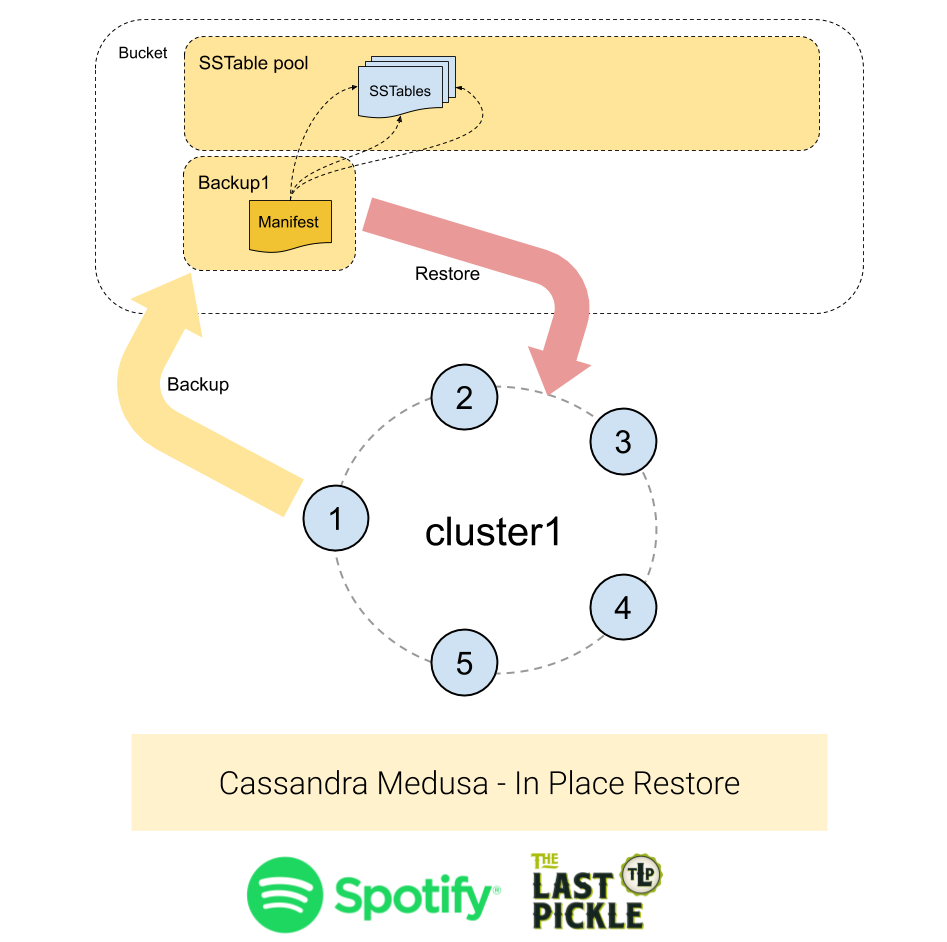
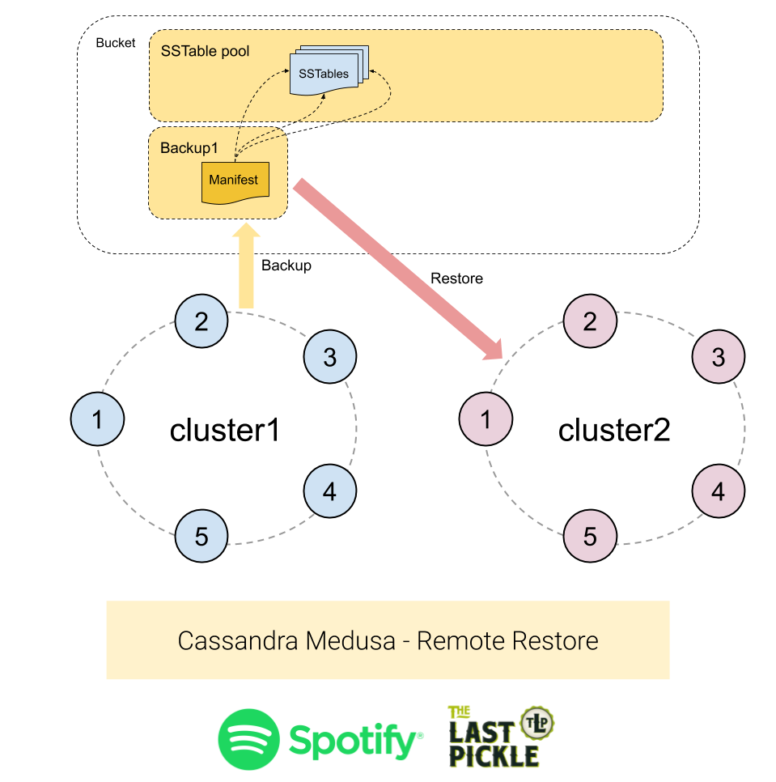
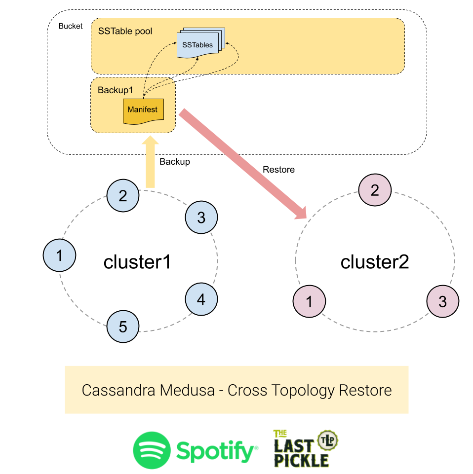

```
$ medusa restore-cluster --help
Usage: medusa restore-cluster [OPTIONS]

  Restore Cassandra cluster

Options:
  --backup-name TEXT              Backup name  [required]
  --seed-target TEXT              seed of the target hosts
  --temp-dir TEXT                 Directory for temporary storage
  --host-list TEXT                List of nodes to restore with the associated
                                  target host

  --keep-auth / --overwrite-auth  Keep/overwrite system_auth as found on the
                                  nodes

  -y, --bypass-checks             Bypasses the security check for restoring a
                                  cluster

  --verify / --no-verify          Verify that the cluster is operational after
                                  the restore completes,

  --keyspace TEXT                 Restore tables from this keyspace, use --keyspace ks1 [--keyspace ks2]
  --table TEXT                    Restore only this table, use --table ks.t1 [--table ks.t2]
  --use-sstableloader             Use the sstableloader to load the backup
                                  into the cluster

  --pssh-pool-size INTEGER        Number of concurrent ssh sessions started by
                                  pssh

  --help                          Show this message and exit.
```

While orchestration is lacking for backups, Medusa coordinates restoring a whole cluster so you only need to run one command. The process connects to nodes via SSH, starting and stopping Cassandra as needed, until the cluster is ready for you to use. The restore process handles three different use cases.

1. Restore to the same cluster. 
1. Restore to a different cluster with the same number of nodes. 
1. Restore to a different cluster with a different number of nodes.

## Case #1 - Restore To The Same Cluster

This is the simplest case: restoring a backup to the same cluster. The topology of the cluster has not changed and all the nodes that were present at the time the backup was created are still running in the cluster.




Use the following command to run an in-place restore:  

```
$ medusa restore-cluster --backup-name=<name of the backup> \
                         [--seed-target node1.domain.net]
```

The seed target node will be used as a contact point to discover the other nodes in the cluster. If not provided, Medusa will use the local node as contact point. Medusa will discover the number of nodes and token assignments in the cluster and check that it matches the topology of the source cluster.

To complete this restore each node will:
 
1. Download the backup data into the `/tmp` directory.
1. Stop Cassandra.
1. Delete the commit log, saved caches and data directory including system keyspaces.
1. Move the downloaded SSTables into to the data directory.
1. Start Cassandra.

The schema does not need to be recreated as it is contained in the system keyspace, and copied from the backup.


## Case #2 - Restore To A Different Cluster With Same Number Of Nodes

Restoring to a different cluster with the same number of nodes is a little harder because:

- The destination cluster may have a different name, which is stored in system.local table.
- The nodes may have different names.
- The nodes may have different token assignments.



Use the following command to run a remote restore:

```
$ medusa restore-cluster --backup-name=<name of the backup> \
                         [--host-list <mapping file>]
```

The optional `host-list` parameter tells Medusa how to map from the original backup nodes to the destination nodes in the new cluster, which is assumed to be a working Cassandra cluster. The mapping file must be a Command Separated File (without a heading row) with the following columns: 

1. **is_seed**: `True` or `False` indicating if the destination node is a seed node. So we can restore and start the seed nodes first. 
1. **target_node**: Host name of a node in the target cluster. 
1. **source_node**: Host name of a source node to copy the backup data from. 

For example:  

```
True,new_node1.foo.net,old_node1.foo.net
True,new_node2.foo.net,old_node2.foo.net
False,new_node3.foo.net,old_node3.foo.net
```

If `host-list` is not provided, Medusa will map nodes by itself and enforce token assignments by updating the `cassandra.yaml` file.

In addition to the steps listed for Case 1 above, when performing a backup to a remote cluster the following steps are taken:  

1. The system.local and system.peers tables are not modified to preserve the cluster name and prevent the target cluster from connecting to the source cluster.
1. The system_auth keyspace is restored from the backup, unless the `--keep-auth` flag is passed to the restore command.
1. Token ownership is updated on the target nodes to match the source nodes by passing the `-Dcassandra.initial_token` JVM parameter when the node is restarted. Which causes ownership to be updated in the local system keyspace.

## Case #3 - Restore To A Different Cluster With A Different Number Of Nodes

Restoring to a different cluster with a different number of nodes is the hardest case to deal with because:

- The destination cluster may have a different name, which is stored in system.local table.
- The nodes may have different names.
- The nodes may have different token assignments.
- Token ranges can never be the same as there is a different number of nodes. 

The last point is the crux of the matter. We cannot get the same token assignments because we have a different number of nodes, and the tokens are assigned to evenly distribute the data between nodes. However the SSTables we have backed up contain data aligned to the token ranges defined in the source cluster. The restore process must ensure the data is placed on the nodes which are replicas according to the new token assignments, or data will appear to have been lost. 

To support restoring data into a different topology Medusa uses the `sstableloader` tool from the Cassandra code base. While slower than copying the files from the backup the sstableloader is able to “repair” data into the destination cluster. It does this by reading the token assignments and streaming the parts of the SSTable that match the new tokens ranges to all the replicas in the cluster.




Use the following command to run a restore to a cluster with a different topology :  

```
$ medusa restore-cluster --backup-name=<name of the backup> \
                         --seed-target target_node1.domain.net
```


Restoring data using this technique has some drawbacks: 

1. The restore will take significantly longer.
1. The amount of data loaded into the cluster will be the size of the backup set multiplied by the Replication Factor. For example, a backup of a cluster with Replication Factor 3 will have 9 copies of the data loaded into it. The extra replicas will be removed by compaction however the total on disk load during the restore process will be higher than what it will be at the end of the restore. See below for a further discussion.  
1. The current schema in the cluster will be dropped and a new one created using the schema from the backup. By default Cassandra will take a snapshot when the schema is dropped, a feature controlled by the `auto_snapshot` configuration setting, which will not be cleared up by Medusa or Cassandra. If there is an existing schema with data it will take extra disk space. This is a sane safety precaution, and a simple work around is to manually ensure the destination cluster does not have any data in it.

A few extra words on the amplification of data when restoring using sstableloader. The backup has the replicated data and lets say we have a Replication Factor of 3, roughly speaking there are 3 copies of each partition. Those copies are spread around the SSTables we collected from each node. As we process each SSTable the sstableloader repairs the data back into the cluster, sending it to the 3 new replicas. So the backup contains 3 copies, we process each copy, and we send each copy to the 3 new replicas, which means in this case:  

- The restore sends nine copies of data to the cluster. 
- Each node gets three copies of data rather than one.

The following sequence of operations will happen when running this type of restore:  

1. Drop the schema objects and re-create them (once for the whole cluster)
1. Download the backup data into the /tmp directory
1. Run the sstableloader for each of the tables in the backup