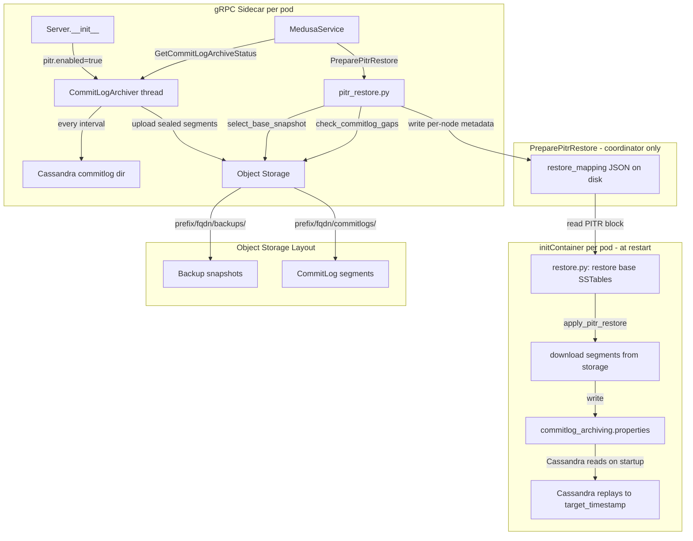
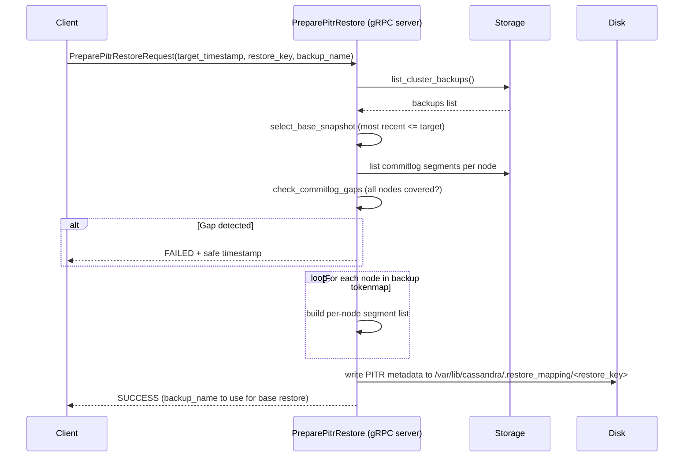

# Point-in-Time Recovery (PITR) for Cassandra Medusa

- **Author(s):** Alexander Dejanovski
- **Status:** Draft
- **Reviewers:** 

---

## 1. Context and Scope

### Background

Cassandra Medusa is a backup and restore tool for Apache Cassandra clusters. It currently supports snapshot-based backups (full and differential) stored in object storage (S3, GCS, Azure, local). Restores can only target an exact backup snapshot, leaving all data written after that snapshot unrecoverable if the cluster is lost or corrupted.

Cassandra itself offers a native mechanism for finer-grained recovery: every mutation is first written to a commitlog segment before being applied. Once a segment is sealed (i.e., the active write position moves to a new segment), it is immutable and can be replayed deterministically. Cassandra exposes a `commitlog_archiving.properties` hook that allows an external process to feed archived segments back into Cassandra on startup, replaying them up to a user-specified timestamp.

### Problem Statement

Operators need to restore a Cassandra cluster to an arbitrary point in time — not just to the moment a snapshot was taken. Typical use cases are:

- **Logical data corruption** (e.g. bad application code writes garbage data at T+5m; the snapshot was taken at T; the operator wants to restore to T+4m).
- **Accidental bulk deletes or truncations** where the exact timestamp of the operation is known.
- **Compliance requirements** mandating a specific recovery point objective (RPO) finer than the snapshot cadence.

### Why Now

The gRPC server mode introduced in Medusa provides a long-lived process context — a prerequisite for running a continuous archiving background thread. With the server model in place, PITR can be added without architectural changes to the core backup/restore pipeline.

### Scope

**In scope:**
- Continuous archiving of sealed Cassandra commitlog segments to object storage.
- A new `PreparePitrRestore` gRPC RPC that coordinates full-cluster PITR restore (validates, gap-checks, writes per-node metadata).
- Per-node PITR restore logic in the existing initContainer (`restore.py`): downloads segments, writes `commitlog_archiving.properties`.
- A new `GetCommitLogArchiveStatus` gRPC RPC for operator health checks.
- Extension of `medusa purge` to delete commitlog segments older than the oldest surviving backup.
- A new `[pitr]` configuration section in `medusa.ini`.

**Out of scope (explicit non-goals):**
- Cross-topology PITR (restoring to a cluster with a different node count).
- DSE-specific commitlog archiving.
- Single-node PITR (handled as the degenerate case of the full-cluster path with one node).
- Custom `restore_command` scripts (Medusa always uses the staging-directory pattern).
- Commitlog encryption (can be layered on using the existing Fernet infrastructure).
- New CLI commands (the existing `medusa-server` gRPC command is the entry point; no new top-level commands are added).

---

## 2. Goals and Non-Goals

### Goals

- **G1:** Enable full-cluster PITR restore to any timestamp between two snapshots.
- **G2:** The archiving daemon runs as a background thread inside the existing gRPC server — no new process, CronJob, or sidecar required.
- **G3:** `pitr.enabled = false` by default; zero behaviour change when PITR is disabled.
- **G4:** All storage operations use the existing `AbstractStorage` abstraction; no backend-specific code is added.
- **G5:** A failed segment upload never crashes the gRPC server.
- **G6:** Commitlog gaps (missing segments for any node in the requested time range) are detected before any restore work begins and surfaced with the latest safe timestamp.

### Non-Goals

- **NG1:** Cross-topology restore (restoring to a cluster with a different node count — commitlog streams are per-node and cannot be safely split or merged).
- **NG2:** Providing a CLI path for PITR; operator tooling is expected to use the gRPC API.
- **NG3:** Providing segment-level granularity within a single Cassandra write batch.

---

## 3. Overview (Executive Summary)

PITR is implemented as two cooperating additions to the existing gRPC server:

1. **`CommitLogArchiver` (background thread):** Started on server startup when `pitr.enabled = true`. Every `commitlog_archive_interval_seconds` (default: 60s) it scans the local Cassandra commitlog directory, identifies sealed segments (all segments except the active one that are older than `commitlog_sealed_grace_seconds`), and uploads any that are missing or partially uploaded to `<prefix>/<fqdn>/commitlogs/` in object storage.

2. **`PreparePitrRestore` RPC (coordinator):** Given a `target_timestamp` and a `restore_key`, it: selects the most recent base snapshot before that timestamp; checks that every node has continuous commitlog coverage from the snapshot to the target; and writes per-node PITR metadata (target timestamp + segment list) into the restore-mapping file on disk — then returns. No data movement happens here.

3. **Per-node `apply_pitr_restore()` (initContainer):** Each Cassandra pod's initContainer runs [`restore.py`](../../../medusa/service/grpc/restore.py), which first restores the base snapshot SSTables locally (existing behaviour), then reads the PITR metadata written by the coordinator, downloads this node's commitlog segments from object storage directly, and writes `commitlog_archiving.properties`. Cassandra is then started by the StatefulSet/operator and replays segments automatically up to `restore_point_in_time` on startup. No SSH is used at any point.

The design is purely additive. Existing backup, restore, and purge commands are unchanged when PITR is disabled.

---

## 4. Proposed Architecture & Detailed Design

### 4.1 System Architecture



### 4.2 New File Map

| File | Change | Responsibility |
|---|---|---|
| [`medusa/config.py`](../../../medusa/config.py) | Modify | `PitrConfig` namedtuple; `[pitr]` section defaults; `MedusaConfig.pitr` field |
| [`medusa/service/grpc/commitlog_archiver.py`](../../../medusa/service/grpc/commitlog_archiver.py) | Create | `CommitLogArchiver` background thread; `find_sealed_segments()` helper |
| [`medusa/service/grpc/server.py`](../../../medusa/service/grpc/server.py) | Modify | Archiver lifecycle; `GetCommitLogArchiveStatus` + `PreparePitrRestore` RPC handlers |
| [`medusa/service/grpc/restore.py`](../../../medusa/service/grpc/restore.py) | Modify | Add `apply_pitr_restore()` — download segments, write `commitlog_archiving.properties` |
| [`medusa/service/grpc/medusa.proto`](../../../medusa/service/grpc/medusa.proto) | Modify | `GetCommitLogArchiveStatus` + `PreparePitrRestore` RPCs and message types |
| [`medusa/pitr_restore.py`](../../../medusa/pitr_restore.py) | Create | Pure restore logic (no gRPC, no SSH, no Cassandra lifecycle) |
| [`medusa/purge.py`](../../../medusa/purge.py) | Modify | `purge_commitlogs()`; PITR hook in `main()` |
| [`medusa-example.ini`](../../../medusa-example.ini) | Modify | Document `[pitr]` config section |

### 4.3 Configuration

A new `[pitr]` section is added to [`medusa/config.py`](../../../medusa/config.py) as a `PitrConfig` namedtuple, parallel to the existing `KubernetesConfig`:

```python
PitrConfig = collections.namedtuple(
    'PitrConfig',
    ['enabled', 'commitlog_archive_interval_seconds', 'commitlog_sealed_grace_seconds']
)
```

Defaults in `_build_default_config()`:

```ini
[pitr]
enabled = false
commitlog_archive_interval_seconds = 60
commitlog_sealed_grace_seconds = 10
```

`enable_md5_checks` is reused from the existing `[checks]` section.

### 4.4 CommitLogArchiver

`CommitLogArchiver` is a `threading.Thread` subclass (daemon thread) started from [`Server.__init__()`](../../../medusa/service/grpc/server.py:51) when PITR is enabled.

**Sealed-segment detection (`find_sealed_segments`):**
- Lists all `CommitLog-*.log` files in `commitlog_directory`.
- The lexicographically largest filename is always the active segment (Cassandra names segments with a monotonic ms timestamp); it is always excluded.
- If only one segment exists, it is the active segment — returns empty.
- A segment is sealed only if its mtime is older than `commitlog_sealed_grace_seconds`.

**Upload loop (`_run_once`):**
1. Find sealed segments.
2. For each sealed segment, check `<prefix>/<fqdn>/commitlogs/<filename>` in storage.
   - If absent → add to upload list.
   - If present and `size` matches local size → skip (or MD5 check if `enable_md5_checks=true`).
   - If present but size mismatches → re-upload (partial upload from prior crash).
3. Call `storage_driver.upload_blobs(to_upload, dest_dir)`.
4. Log and update internal status counters under a lock.
5. Any exception is caught and logged; the thread continues.

**Lifecycle:**
- `start()` — begins the polling loop (inherited from `Thread`).
- `stop()` — sets a `threading.Event`; joins with `timeout=interval+5s`.
- `status() → dict` — returns `running`, `last_upload_time`, `pending_count`, `interval_seconds`.

### 4.5 pitr_restore.py — Pure Restore Logic

[`medusa/pitr_restore.py`](../../../medusa/pitr_restore.py) contains only decision logic with no gRPC or SSH dependencies, making it independently testable.

| Function | Signature | Description |
|---|---|---|
| `select_base_snapshot` | `(storage, target_timestamp_s: float) -> ClusterBackup` | Most recent backup with `finished ≤ target_timestamp_s`; raises `ValueError` if none |
| `find_commitlog_segments` | `(storage_driver, prefix_path, fqdn, after_ts_ms, before_ts_ms) -> List[str]` | Storage paths of segments in range, sorted ascending |
| `check_commitlog_gaps` | `(storage_driver, prefix_path, fqdns, after_ts_ms, before_ts_ms) -> Optional[float]` | `None` if all nodes covered; else safe Unix timestamp (s) |
| `generate_commitlog_archiving_properties` | `(restore_command: str, target_timestamp_s: float) -> str` | `commitlog_archiving.properties` file content |

Segment timestamp extraction uses the embedded millisecond timestamp in `CommitLog-<version>-<ts_ms>.log` filenames (regex: `CommitLog-\d+-(\d+)\.log$`). No separate index or manifest is needed.

### 4.6 Kubernetes Restore Model — Why SSH Orchestration Does Not Apply

Understanding the existing Kubernetes restore flow is essential before designing the PITR restore path.

In Kubernetes, Medusa runs as **two containers in every Cassandra pod**:

- **Sidecar container** (`MEDUSA_MODE=GRPC`): runs the gRPC server (including `CommitLogArchiver`). It has direct access to the local filesystem and the local Cassandra commitlog directory.
- **initContainer** (`MEDUSA_MODE=RESTORE`): runs [`medusa/service/grpc/restore.py`](../../../medusa/service/grpc/restore.py) once at pod startup. It calls [`restore_node.restore_node()`](../../../medusa/restore_node.py) which downloads SSTables, places data, and returns — **without starting Cassandra**. The StatefulSet or Cassandra operator manages pod lifecycle and starts Cassandra.

The existing `PrepareRestore` RPC in the gRPC server acts as a **coordinator only**: it writes per-node host-map metadata to `/var/lib/cassandra/.restore_mapping/<restore_key>`, which each node's initContainer reads at startup via the `RESTORE_MAPPING` env var and uses to determine which source node to pull data from.

There is **no SSH orchestration in the Kubernetes path**. Each node restores itself locally. The `Orchestration`/SSH layer in `medusa/orchestration.py` is the non-Kubernetes path and must not be used here.

### 4.7 PreparePitrRestore — Coordinator RPC

The PITR coordinator follows the same pattern as `PrepareRestore`: the gRPC server performs all validation and writes per-node metadata; each node's initContainer reads and acts on it locally at startup.

**New RPC: `PreparePitrRestore`** (replaces `RestoreClusterToTimestamp` from the original plan)

Steps executed by the gRPC server (runs once, centrally, before pods are restarted):



The **topology check** (node count) is dropped from this RPC: in Kubernetes, node identity is managed by the StatefulSet and operators are responsible for ensuring the cluster topology is compatible before triggering a restore. Forcing a CQL connection to the live cluster from the coordinator is fragile during a restore operation.

The metadata written to disk for each node includes:
```json
{
  "in_place": true,
  "host_map": { "..." : "..." },
  "pitr": {
    "target_timestamp_s": 1721000000.0,
    "segments": ["<prefix>/node1.fqdn/commitlogs/CommitLog-6-1234567890.log", "..."]
  }
}
```

### 4.8 Per-Node PITR Restore — initContainer

After `PreparePitrRestore` succeeds, the operator restarts the pods (or the Cassandra operator handles this). Each pod's initContainer runs [`restore.py`](../../../medusa/service/grpc/restore.py), which is extended to handle PITR:

```
restore.py (initContainer)
  |-- apply_mapping_env()  [existing: reads RESTORE_MAPPING, sets source fqdn]
  |-- restore_backup()     [existing: downloads SSTables via restore_node.restore_node()]
  +-- apply_pitr_restore() [NEW: if pitr block present in mapping]
        |-- download segments listed in pitr.segments to local staging dir
        |-- write commitlog_archiving.properties (restore_command, restore_point_in_time)
        +-- return  (Kubernetes starts Cassandra; it replays segments on startup)
```

The `restore_node_locally()` function already calls `clean_path(cassandra.commit_logs_path, ...)` to wipe the commitlog directory before returning. The `commitlog_archiving.properties` file must be written **after** this cleanup step, as it lives in the Cassandra config directory (e.g. `/etc/cassandra/`), not the commitlog directory.

Cassandra startup (handled by the pod/operator) detects `commitlog_archiving.properties` and replays segments up to `restore_point_in_time` automatically. No Medusa code starts or stops Cassandra.

**Cleanup:** After Cassandra is confirmed up (outside Medusa's scope, managed by the operator readiness probe), `commitlog_archiving.properties` and the staging directory should be removed. This can be done by a post-start hook or a subsequent operator step. Medusa does not need to orchestrate this.

`target_timestamp` in the request accepts either a Unix epoch float string or ISO-8601.

### 4.9 Revised File Map for Restore Path

| File | Change | Responsibility |
|---|---|---|
| [`medusa/service/grpc/server.py`](../../../medusa/service/grpc/server.py) | Modify | Add `PreparePitrRestore` RPC handler (coordinator) |
| [`medusa/service/grpc/restore.py`](../../../medusa/service/grpc/restore.py) | Modify | Add `apply_pitr_restore()` — download segments, write properties |
| [`medusa/pitr_restore.py`](../../../medusa/pitr_restore.py) | Create | Pure restore logic: `select_base_snapshot`, `find_commitlog_segments`, `check_commitlog_gaps`, `generate_commitlog_archiving_properties` |
| [`medusa/service/grpc/medusa.proto`](../../../medusa/service/grpc/medusa.proto) | Modify | `PreparePitrRestore` RPC + message types (replaces `RestoreClusterToTimestamp`) |

The `RestoreClusterToTimestamp` RPC from the original plan is replaced by `PreparePitrRestore`. A separate `RestoreClusterToTimestamp` that orchestrates the full flow over SSH is not needed in the Kubernetes deployment target.

### 4.10 Purge Integration

[`purge_commitlogs(storage, fqdn, oldest_kept_finished_ts)`](../../../medusa/purge.py) is called from `main()` inside the existing `with Storage(...) as storage:` block when `pitr.enabled = true`. It deletes all segments under `<prefix>/<fqdn>/commitlogs/` whose embedded timestamp (ms) is strictly less than `oldest_kept_finished_ts * 1000`.

The `oldest_kept_finished_ts` is derived from the minimum `finished` timestamp across all backups that purge decides to retain — guaranteeing a complete commitlog chain for every surviving backup.

### 4.11 Proto Changes

Two new RPCs are added to the `Medusa` service in [`medusa.proto`](../../../medusa/service/grpc/medusa.proto):

```protobuf
rpc GetCommitLogArchiveStatus(GetCommitLogArchiveStatusRequest)
    returns (GetCommitLogArchiveStatusResponse);

rpc RestoreClusterToTimestamp(RestoreClusterToTimestampRequest)
    returns (RestoreClusterToTimestampResponse);
```

`medusa_pb2.py` and `medusa_pb2_grpc.py` must be regenerated with `grpc_tools.protoc` after the proto change.

### 4.12 Object Storage Layout

```
<prefix>/<fqdn>/commitlogs/CommitLog-6-1234567890123.log
<prefix>/<fqdn>/commitlogs/CommitLog-6-1234567890456.log
```

- Same bucket and `<prefix>` as backups — no new bucket or credential required.
- Segment filenames are preserved verbatim from Cassandra.
- The embedded millisecond timestamp is the sole basis for time-based filtering (no manifest).

---

## 5. Alternative Solutions & Trade-offs

### Option A — CommitLog archiver as a separate sidecar/process (Rejected)

**Pros:**
- Isolation — archiver failures cannot affect the gRPC server.
- Independent scaling.

**Cons:**
- Requires a new Docker image, Kubernetes Deployment, and service account.
- Requires shared filesystem or API access to Cassandra's commitlog directory from a separate pod — complex and fragile in Kubernetes environments.
- Significantly higher operational overhead for what is ultimately a single-purpose polling loop.

**Why rejected:** The gRPC server already has access to the local filesystem, storage credentials, and lifecycle management. A background thread within the server achieves the same archiving goal with zero additional deployment complexity.

### Option B — Push-based archiving via Cassandra's built-in `commitlog_archiving.properties` archive_command (Rejected)

Cassandra natively supports an `archive_command` in `commitlog_archiving.properties` that fires a shell command whenever a segment is sealed.

**Pros:**
- No polling — events are push-driven and instant.
- No sealed-segment detection logic needed.

**Cons:**
- Requires writing and deploying a helper binary/script to every Cassandra node.
- Configuring and restarting Cassandra on each node adds operational complexity.
- The helper must handle storage credentials and retries independently.
- Introduces an out-of-band component outside Medusa's process model — monitoring and failure handling become fragmented.

**Why rejected:** Medusa already has a fully-featured storage abstraction and retry logic. Running archiving inside the gRPC server keeps all storage operations centralised and observable via the existing `GetCommitLogArchiveStatus` RPC.

### Option C — Store a segment manifest / index file (Rejected)

Instead of deriving the timestamp from the filename, maintain a JSON manifest in storage mapping each segment to its time range.

**Pros:**
- Enables arbitrary segment metadata (keyspace coverage, schema version, etc.).

**Cons:**
- Adds concurrency complexity: manifest updates must be atomic.
- The filename timestamp is already authoritative (Cassandra guarantees it).
- Complicates the purge logic — two objects to delete per segment.

**Why rejected:** Cassandra segment filenames are monotonically increasing millisecond timestamps. Parsing the filename is sufficient and eliminates a whole category of consistency bugs.

---

## 6. Cross-Cutting Concerns & Operational Aspects

### 6.1 Scalability & Performance

- **Upload frequency:** Default 60s interval. One storage API call per sealed segment per tick — at 100 MB/s ingress and a 256 MB segment size, a busy node generates ~0.4 segments/minute. At 60s intervals, steady-state is 0–1 uploads/tick per node. This is negligible compared to backup traffic.
- **Storage overhead:** Commitlog segments are typically 32–256 MB. A cluster writing 1 GB/s across all nodes accumulates ~8.6 TB/day of raw commitlog data. Operators should size object storage and set appropriate purge windows accordingly.
- **Thread overhead:** One daemon thread per gRPC server pod. No thread pool fan-out within the archiver.
- **Restore latency:** PITR restore is bounded by base-snapshot restore time (existing bottleneck) plus commitlog download and Cassandra replay time. The replay step is performed by Cassandra itself in parallel with normal startup; it is not a Medusa bottleneck.

### 6.2 Security & Privacy

- All storage access uses the existing `AbstractStorage` credential chain (IAM role, service account key, etc.) — no new credentials.
- Commitlog segments contain raw mutation data. They are subject to the same object-storage ACL and encryption-at-rest controls as backup snapshots.
- Segment download in the initContainer uses the existing storage driver directly — no SSH, no new network credentials.
- No new network ports or firewall rules are required.

### 6.3 Observability & Monitoring

- **`GetCommitLogArchiveStatus` RPC:** Returns `running`, `last_upload_time`, `pending_count`, `interval_seconds`. Operators should alert on `pending_count > N` for sustained periods (indicating upload failures) and `running=false` (archiver stopped unexpectedly).
- **Logging:** The archiver logs at `INFO` on each successful upload batch and at `ERROR`/`WARNING` on upload failures or directory access errors.
- **Purge logging:** `purge_commitlogs()` logs the count of deleted segments at `INFO`.

### 6.4 Failure Modes & Resilience

| Scenario | Behaviour |
|---|---|
| Upload failure (network, quota) | Logged at ERROR; retried next tick. Server continues. |
| Commitlog directory inaccessible | Logged per tick; visible via `GetCommitLogArchiveStatus` (`pending_count=0`, `running=true`). No crash. |
| Storage backend unreachable | Existing tenacity retry in storage driver applies before error propagates to archiver. |
| Partial upload (size mismatch) | Detected on next tick; segment is re-uploaded. |
| No base snapshot before target | `PreparePitrRestore` returns `FAILED` immediately. No data movement started. |
| Commitlog gap detected | RPC returns `FAILED` with the latest safe `target_timestamp`. No restore started. |
| Cassandra fails to start after replay | Surfaced by the pod readiness probe / Cassandra operator. Medusa does not start Cassandra in the Kubernetes path. |
| gRPC server pod restart | Archiver restarts cleanly; size/hash check prevents duplicate uploads of already-archived segments. |
| initContainer crashes mid-download | Pod restarts; `restore.py` is idempotent — it re-downloads segments and re-writes properties. Staging dir may have partial files; the download step overwrites them. |

### 6.5 Testing & Rollout Plan

**Unit tests (new):**
- [`tests/service/grpc/commitlog_archiver_test.py`](../../../tests/service/grpc/commitlog_archiver_test.py): `find_sealed_segments` edge cases (active segment exclusion, grace period, single-segment directory, empty directory); `CommitLogArchiver._run_once` with mocked storage driver (upload, skip, re-upload, failure-does-not-raise).
- [`tests/pitr_restore_test.py`](../../../tests/pitr_restore_test.py): `select_base_snapshot` (correct selection, error when no candidate), `find_commitlog_segments` (range filtering), `check_commitlog_gaps` (no gap → None, missing node → safe timestamp), `generate_commitlog_archiving_properties` (correct Cassandra timestamp format).
- [`tests/config_test.py`](../../../tests/config_test.py): `PitrConfig` defaults and custom values via `load_config`.
- [`tests/purge_test.py`](../../../tests/purge_test.py): `purge_commitlogs` deletes segments below threshold; skips segments above threshold.
- [`tests/service/grpc/server_test.py`](../../../tests/service/grpc/server_test.py): `GetCommitLogArchiveStatus` with no archiver returns `running=false`; `PreparePitrRestore` writes correct metadata to disk.
- [`tests/service/grpc/restore_test.py`](../../../tests/service/grpc/restore_test.py): `apply_pitr_restore()` downloads correct segments and writes valid `commitlog_archiving.properties`.

**Integration tests (future, not part of this design):**
1. Start cluster; run workload; take snapshot.
2. Run additional writes; allow archiver to upload segments.
3. Record target timestamp mid-workload.
4. Call `RestoreClusterToTimestamp`.
5. Assert row counts match expected state at target timestamp.

**Rollout:**
1. Merge with `pitr.enabled = false` default — no behaviour change in production.
2. Enable in a non-production environment; verify archiver uploads via `GetCommitLogArchiveStatus`.
3. Test a PITR restore on a non-production cluster.
4. Enable in production with an initial purge window large enough to retain all desired recovery points.

---

## 7. Open Questions

1. **`PreparePitrRestore` vs `PrepareRestore` integration:** Should `PreparePitrRestore` be a separate RPC, or should `PrepareRestore` be extended with an optional `pitr` block (target timestamp) that enriches the existing restore-mapping JSON? A single RPC would let the operator trigger both the base restore and the PITR metadata in one call. A separate RPC is cleaner but requires two calls. Decision needed before Task 5.

2. **Segment download in initContainer:** `apply_pitr_restore()` in `restore.py` will download segments using the storage driver directly (no SSH). Confirm that the storage driver is importable and functional inside the initContainer image with no additional dependencies beyond what is already installed.

3. **`commitlog_archiving.properties` location:** The file should be written to the Cassandra config directory (e.g. `/etc/cassandra/` or wherever `config.cassandra.config_file` lives). Confirm the exact path and that the initContainer has write permissions there. The properties file must survive until Cassandra reads it on startup; confirm it is not on an ephemeral mount that gets wiped between init and main container startup. This could be problematic because of how configuration files are generated by the config builder init container and the fact that we're using a read only root filesystem. We also have to ensure that a subsequent restart wouldn't consider the previous restore timestamp for replay.

4. **Cleanup of staging dir and properties file:** In Kubernetes, Medusa cannot observe when Cassandra has finished replaying. Options: (a) leave cleanup to the operator/post-start hook, (b) add a new `CleanupPitrRestore` RPC the operator calls after the node is healthy, (c) write a marker file that Cassandra's startup hook removes. Decision needed.

5. **Purge scope:** `purge_commitlogs` operates on the local node's `fqdn`. In Kubernetes, each pod purges its own node's segments — this is correct and consistent with the per-pod sidecar model. No change needed, but this assumption should be documented explicitly.

6. **Commitlog segments and TTL data:** Replaying a commitlog past a cell's TTL expiry timestamp can resurrect expired data. Is this a known acceptable trade-off for this project's use cases, or does it require an operator warning in the RPC response?

