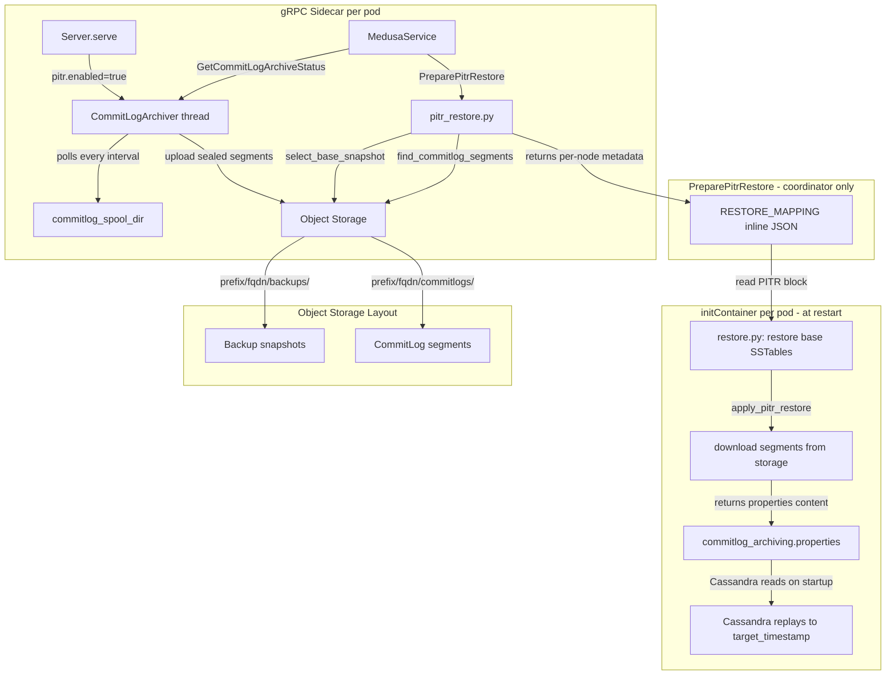
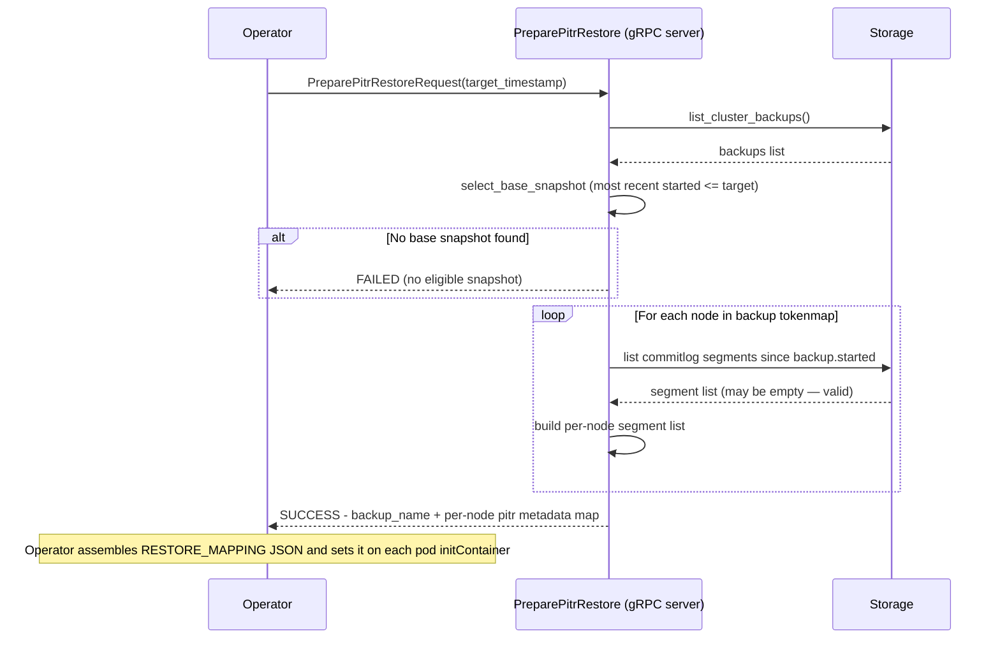

# Point-in-Time Recovery (PITR) for Cassandra Medusa

- **Author(s):** Alexander Dejanovski
- **Status:** Draft
- **Reviewers:** 

---

## 1. Context and Scope

### Background

Cassandra Medusa is a backup and restore tool for Apache Cassandra clusters. It currently supports snapshot-based backups (full and differential) stored in object storage (S3, GCS, Azure, local). Restores can only target an exact backup snapshot, leaving all data written after that snapshot unrecoverable if the cluster is lost or corrupted.

Cassandra itself offers a native mechanism for finer-grained recovery: every mutation is first written to a commitlog segment before being applied. Once a segment is sealed (i.e., the active write position moves to a new segment), it is immutable and can be replayed deterministically. Cassandra exposes a `commitlog_archiving.properties` hook with two commands: `archive_command` fires when a segment is finalized (after the final sync and before deletion) and can be used to preserve the segment; `restore_command` fires during startup replay to fetch each required segment. Together they allow an external process to archive sealed segments and feed them back during a targeted restore, replaying mutations up to a user-specified timestamp.

### Problem Statement

Operators need to restore a Cassandra cluster to an arbitrary point in time — not just to the moment a snapshot was taken. Typical use cases are:

- **Logical data corruption** (e.g. bad application code writes garbage data at T+5m; the snapshot was taken at T; the operator wants to restore to T+4m).
- **Accidental bulk deletes or truncations** where the exact timestamp of the operation is known.
- **Compliance requirements** mandating a specific recovery point objective (RPO) finer than the snapshot cadence.

### Why Now

The gRPC server mode introduced in Medusa provides a long-lived process context — a prerequisite for running a continuous archiving background thread. With the server model in place, PITR can be added without architectural changes to the core backup/restore pipeline.

### Scope

**In scope:**
- Continuous archiving of sealed Cassandra commitlog segments to object storage. Cassandra's `archive_command` (configured by the operator) creates a hardlink of each finalized segment into a local spool directory; Medusa's `CommitLogArchiver` thread monitors that spool, uploads segments to object storage, and removes the hardlink on completion.
- A new `PreparePitrRestore` gRPC RPC that prepares per-node metadata for a PITR restore (selects base snapshot, collects all segments archived since that snapshot per node, writes per-node segment lists); each node then self-restores locally.
- Per-node PITR restore logic in [`restore.py`](../../../medusa/service/grpc/restore.py) (the per-node restore entrypoint): downloads segments, writes `commitlog_archiving.properties`.
- A new `GetCommitLogArchiveStatus` gRPC RPC for operator health checks.
- Extension of `medusa purge` to delete commitlog segments older than the oldest surviving backup.
- A new `[pitr]` configuration section in `medusa.ini`.

**Out of scope (explicit non-goals):**
- Cross-topology PITR (restoring to a cluster with a different node count).
- DSE-specific commitlog archiving.
- Custom `restore_command` scripts (Medusa always uses the staging-directory pattern).
- Commitlog encryption (segments are subject to the same object-storage encryption-at-rest as backup snapshots; no Medusa-side encryption is added).
- New CLI commands (the existing `medusa-server` gRPC command is the entry point; no new top-level commands are added).

---

## 2. Goals and Non-Goals

### Goals

- **G1:** Enable full-cluster PITR restore to any timestamp covered by archived commitlog segments since the base snapshot.
- **G2:** The archiving daemon runs as a background thread inside the existing gRPC server — no new process, CronJob, or sidecar required.
- **G3:** `pitr.enabled = false` by default; zero behaviour change when PITR is disabled.
- **G4:** All storage operations use the existing `AbstractStorage` abstraction; no backend-specific code is added.
- **G5:** A failed segment upload never crashes the gRPC server.
- **G6:** Segment finalization is guaranteed by Cassandra's `archive_command` hook before Medusa touches any segment — Medusa never reads from the live commitlog directory.

### Non-Goals

- **NG1:** Cross-topology restore (restoring to a cluster with a different node count — commitlog streams are per-node and cannot be safely split or merged).
- **NG2:** Providing a CLI path for PITR; operator tooling is expected to use the gRPC API.
- **NG3:** Providing segment-level granularity within a single Cassandra write batch.

### Success Criteria

| # | Criterion | How verified |
|---|---|---|
| SC1 | A PITR restore to timestamp T produces a cluster state where all rows written before T are present and all rows written after T are absent | Integration test: row count assertion at a known target timestamp |
| SC2 | `CommitLogArchiver` uploads all segments present in the spool before sleeping until the next tick — a slow batch delays the next tick rather than being interrupted by it | Unit test: `_run_once` with mock storage returning N files; assert all N are uploaded and removed before the sleep call is made |
| SC3 | A failed segment upload does not crash the gRPC server; the segment remains in the spool and is retried on the next tick | Unit test: `_run_once` raises on upload; server continues; segment still present in spool |
| SC4 | `pitr.enabled = false` (default) produces zero behaviour change to existing backup, restore, and purge commands | Existing test suite passes unchanged when PITR config is absent |
| SC5 | `PreparePitrRestore` returns `FAILED` immediately when no base snapshot predates `target_timestamp` | Unit test: `select_base_snapshot` raises `ValueError`; RPC maps to FAILED response |
| SC6 | `CommitLogArchiver.__init__` raises `RuntimeError` with a clear message when spool dir and commitlog dir are on different devices | Unit test: `os.stat` mocked to return differing `st_dev` |
| SC7 | `purge_commitlogs` deletes all segments whose `blob.last_modified < purge_threshold` and retains all others | Unit test: mock blob list with boundary values |

---

## 3. Overview (Executive Summary)

PITR is implemented as two cooperating additions to the existing gRPC server:

1. **`CommitLogArchiver` (background thread):** Started on server startup when `pitr.enabled = true`. It polls the local commitlog spool directory (`commitlog_spool_dir`) every `commitlog_archive_interval_seconds` (default: 60s). The spool is populated by Cassandra's `archive_command` (configured by the operator), which creates a hardlink of each finalized segment into that directory immediately after the segment is synced and sealed — guaranteeing Medusa never sees a partially-written file. For each file found, the archiver uploads it to `<prefix>/<fqdn>/commitlogs/` in object storage and removes the hardlink on success.

2. **`PreparePitrRestore` RPC:** Given a `target_timestamp`, it: selects the most recent base snapshot with `started ≤ target_timestamp`; collects all segments in object storage for each node from `backup.started` forward (no upper bound, no gap check); and returns the base backup name plus a per-node map of `{target_timestamp_s, segments[]}` in the response. No data movement happens here. The operator embeds this per-node metadata directly in the `RESTORE_MAPPING` env var as inline JSON (a `pitr` block alongside the existing `in_place` / `host_map` fields) before restarting the pods — exactly the same mechanism `MedusaRestoreJob` uses for the base restore mapping.

3. **Per-node `apply_pitr_restore()`:** [`restore.py`](../../../medusa/service/grpc/restore.py) (the per-node restore entrypoint) first restores the base snapshot SSTables locally (existing behaviour), then reads the PITR metadata for this node, downloads all of its commitlog segments from object storage to a local staging directory, and writes `commitlog_archiving.properties` (with `restore_directories` pointing to the staging directory and `restore_point_in_time` set to the target; `restore_command` is left unset so Cassandra uses its default directory-scan behaviour). Cassandra is started by the operator and replays segments up to `restore_point_in_time` automatically on startup; Cassandra's own replay logic skips mutations already persisted in the base SSTables. No SSH is used at any point.

The design is purely additive. Existing backup, restore, and purge commands are unchanged when PITR is disabled.

---

## 4. Proposed Architecture & Detailed Design

### 4.1 System Architecture



### 4.2 New File Map

| File | Change | Responsibility |
|---|---|---|
| [`medusa/config.py`](../../../medusa/config.py) | Modify | `PitrConfig` namedtuple; `[pitr]` section defaults; `MedusaConfig.pitr` field |
| [`medusa/service/grpc/commitlog_archiver.py`](../../../medusa/service/grpc/commitlog_archiver.py) | Create | `CommitLogArchiver` background thread; `drain_spool()` helper |
| [`medusa/service/grpc/server.py`](../../../medusa/service/grpc/server.py) | Modify | Archiver lifecycle; `GetCommitLogArchiveStatus` + `PreparePitrRestore` RPC handlers |
| [`medusa/service/grpc/restore.py`](../../../medusa/service/grpc/restore.py) | Modify | Add `apply_pitr_restore()` — download segments, write `commitlog_archiving.properties` to `Path(cassandra_config.config_file).parent` |
| [`medusa/service/grpc/medusa.proto`](../../../medusa/service/grpc/medusa.proto) | Modify | `GetCommitLogArchiveStatus` + `PreparePitrRestore` RPCs and message types |
| [`medusa/pitr_restore.py`](../../../medusa/pitr_restore.py) | Create | Pure restore logic (no gRPC, no SSH, no Cassandra lifecycle) |
| [`medusa/purge.py`](../../../medusa/purge.py) | Modify | `purge_commitlogs()`; PITR hook in `main()` |
| [`medusa-example.ini`](../../../medusa-example.ini) | Modify | Document `[pitr]` config section |

### 4.3 Configuration

A new `[pitr]` section is added to [`medusa/config.py`](../../../medusa/config.py) as a `PitrConfig` namedtuple, parallel to the existing `KubernetesConfig`:

```python
PitrConfig = collections.namedtuple(
    'PitrConfig',
    ['enabled', 'commitlog_archive_interval_seconds', 'commitlog_spool_dir']
)
```

Defaults in `_build_default_config()`:

```ini
[pitr]
enabled = false
commitlog_archive_interval_seconds = 60
commitlog_spool_dir = /medusa-commitlog-spool
```

`commitlog_spool_dir` must be on the same filesystem (volume) as Cassandra's commitlog directory — hardlinks cannot cross filesystem boundaries. In Kubernetes, this is the shared volume mounted into both the Cassandra container and the Medusa sidecar.

`[checks].enable_md5_checks` is reused from the existing `[checks]` section for upload deduplication.

### 4.4 CommitLogArchiver

`CommitLogArchiver` is a `threading.Thread` subclass (daemon thread) started from [`Server.serve()`](../../../medusa/service/grpc/server.py:66) when PITR is enabled, and stopped in `Server.shutdown()`. Starting it in `serve()` (rather than `__init__`) avoids thread leaks in unit test suites where `Server` is instantiated without being run.

**Startup validation:**

`CommitLogArchiver.__init__` checks that `commitlog_spool_dir` and the Cassandra commitlog directory reside on the same filesystem by comparing `os.stat(commitlog_spool_dir).st_dev` with `os.stat(cassandra_commitlog_dir).st_dev`. If they differ, it raises `RuntimeError` immediately with a message of the form:

```
commitlog_spool_dir '<path>' is on a different device than the Cassandra commitlog
directory '<path>'. Hardlinks cannot cross filesystem boundaries. Mount both paths
on the same volume.
```

This prevents a silent `EXDEV` failure when Cassandra first executes `archive_command`.

**Spool drain (`drain_spool`):**

Medusa never reads from Cassandra's live commitlog directory. Instead, the operator configures Cassandra with:

```
archive_command=ln %path <commitlog_spool_dir>/%name
```

Cassandra executes this command after the segment's final fsync and before it is eligible for deletion — the hardlink is therefore always a complete, immutable snapshot of the finalized file. Because hardlinks share the same inode, creation is atomic and requires no data copy; they do require the spool directory and the commitlog directory to be on the same filesystem (same volume).

`drain_spool` lists all files in `commitlog_spool_dir`, and for each:
1. Checks `<prefix>/<fqdn>/commitlogs/<filename>` in storage.
   - If absent → upload.
   - If present and size matches → skip (already uploaded); or MD5 check if `[checks].enable_md5_checks=true`.
   - If present but size mismatches → re-upload (partial upload from a prior crash).
2. On successful upload or confirmed-present skip: removes the hardlink from the spool.
3. On upload failure: logs the error, leaves the hardlink in place for retry next tick.

**Upload loop (`_run_once`):**

`_run_once` is invoked from a single daemon thread only — there are no concurrent invocations. The internal lock guards only the status counters read by `status()`.

1. Call `drain_spool()`, which handles the full per-file cycle: check storage, upload or skip, remove hardlink on success, log on failure.
2. Update internal status counters under a lock.
3. Any exception from `drain_spool()` is caught and logged; the thread continues.

**Lifecycle:**
- `start()` — begins the polling loop (inherited from `Thread`).
- `stop()` — sets a `threading.Event`; joins with `timeout=interval+5s`.
- `status() → dict` — returns `running`, `last_upload_time`, `pending_count`, `interval_seconds`.

### 4.5 pitr_restore.py — Pure Restore Logic

[`medusa/pitr_restore.py`](../../../medusa/pitr_restore.py) contains only decision logic with no gRPC or SSH dependencies, making it independently testable.

| Function | Signature | Description |
|---|---|---|
| `select_base_snapshot` | `(storage, target_timestamp_s: float) -> ClusterBackup` | Most recent backup with `started ≤ target_timestamp_s`; raises `ValueError` if none |
| `find_commitlog_segments` | `(storage_driver, prefix_path, fqdn, after_backup_started_s: float) -> List[str]` | All storage paths for this node with `blob.last_modified ≥ after_backup_started_s`; sorted ascending by filename. No upper bound — Cassandra's `restore_point_in_time` is the cutoff. |
| `generate_commitlog_archiving_properties` | `(restore_directories: str, target_timestamp_s: float) -> str` | `commitlog_archiving.properties` file content (`restore_directories` and `restore_point_in_time` only; `restore_command` left unset) |

`check_commitlog_gaps` is removed. There is no gap check: a node with zero segments since the snapshot simply has an empty list; Cassandra replays nothing for that node, which is correct (it had no writes in that interval). The operator is responsible for confirming that archiving was active since the base snapshot was taken.

Segment filenames are used only for ordering and as storage object keys — their embedded ID is not used for time filtering.

### 4.6 Kubernetes Restore Model — Why SSH Orchestration Does Not Apply

Understanding the existing Kubernetes restore flow is essential before designing the PITR restore path.

In Kubernetes, Medusa runs as **two containers in every Cassandra pod**:

- **Sidecar container** (`MEDUSA_MODE=GRPC`): runs the gRPC server (including `CommitLogArchiver`). It has direct access to the local filesystem and the local Cassandra commitlog directory.
- **initContainer** (`MEDUSA_MODE=RESTORE`): runs [`medusa/service/grpc/restore.py`](../../../medusa/service/grpc/restore.py) once at pod startup. It calls [`restore_node.restore_node()`](../../../medusa/restore_node.py) which downloads SSTables, places data, and returns — **without starting Cassandra**. The StatefulSet or Cassandra operator manages pod lifecycle and starts Cassandra.

In the Kubernetes path, the `MedusaRestoreJob` controller calls `GetHostMap` (a gRPC call that lists the backup's nodes and derives a source→target mapping locally in the operator), stores the result in `MedusaRestoreJob.Status.RestoreMapping`, marshals it to inline JSON, and injects it as the `RESTORE_MAPPING` env var on the `medusa-restore` initContainer in the `CassandraDatacenter` `PodTemplateSpec`. A rolling restart propagates this to every pod; the initContainer reads its own entry from the env var at startup. No file is written to disk.

There is **no SSH orchestration in the Kubernetes path**. Each node restores itself locally. The `Orchestration`/SSH layer in `medusa/orchestration.py` is the non-Kubernetes path and must not be used here.

### 4.7 PreparePitrRestore — Coordinator RPC

The PITR coordinator follows the same pattern as `MedusaRestoreJob` in the k8ssandra-operator: the gRPC server performs all storage queries and returns the result to the caller; the operator assembles the full `RESTORE_MAPPING` JSON and injects it directly into the initContainer env var. No file is written to disk by the RPC.

**Metadata delivery:** `PreparePitrRestore` is called against any live Medusa gRPC sidecar (the operator chooses which pod to target — no election needed). The RPC returns the base backup name and a per-node PITR metadata map in the response. The operator then:
1. Calls `GetHostMap` (as in a regular restore) to compute `in_place` / `host_map`.
2. Embeds the PITR per-node data from the `PreparePitrRestore` response as a `pitr` block inside the `RESTORE_MAPPING` JSON.
3. Sets `RESTORE_MAPPING=<inline-JSON>` on every pod's initContainer before restarting them.

Each pod's `restore.py` reads `RESTORE_MAPPING` via `json.loads()` (existing code, unchanged) and finds the `pitr` block for its own FQDN. This RPC is idempotent and safe to retry: all operations are read-only against object storage.

**New RPC: `PreparePitrRestore`** (replaces `RestoreClusterToTimestamp` from the original plan)

Steps executed by the gRPC server (runs once, centrally, before pods are restarted):



The **topology check** (node count) is dropped from this RPC: in Kubernetes, node identity is managed by the StatefulSet and operators are responsible for ensuring the cluster topology is compatible before triggering a restore. Forcing a CQL connection to the live cluster from the coordinator is fragile during a restore operation.

The `RESTORE_MAPPING` JSON set by the operator on each pod's initContainer:
```json
{
  "in_place": true,
  "host_map": { "node1.fqdn": {"source": ["node1.fqdn"], "seed": false} },
  "pitr": {
    "target_timestamp_s": 1721000000.0,
    "segments": ["<prefix>/node1.fqdn/commitlogs/CommitLog-6-1234567890.log", "..."]
  }
}
```

The `pitr.segments` list is **node-specific**: the operator inserts only the segments for the target pod's FQDN. Each pod's `restore.py` reads its own `RESTORE_MAPPING` env var and uses the `pitr` block directly — no file lookup, no key indirection.

### 4.8 Per-Node PITR Restore — per-node restore entrypoint

After `PreparePitrRestore` succeeds, the operator restarts the pods. Each pod's per-node restore entrypoint ([`restore.py`](../../../medusa/service/grpc/restore.py)) is extended to handle PITR:

```
restore.py (per-node restore entrypoint, MEDUSA_MODE=RESTORE)
  |-- apply_mapping_env()  [existing: json.loads(RESTORE_MAPPING) — unchanged]
  |-- restore_backup()     [existing: downloads SSTables via restore_node.restore_node()]
  +-- apply_pitr_restore() [NEW: called if mapping["pitr"] is present AND restore marker file is absent]
        |-- write commitlog_archiving.properties to Path(cassandra_config.config_file).parent
        +-- download segments listed in mapping["pitr"]["segments"] to local staging dir
            (Cassandra reads commitlog_archiving.properties on startup and replays segments
             up to restore_point_in_time)
```

**`RESTORE_MAPPING` format:** `apply_mapping_env()` is not modified. `RESTORE_MAPPING` is always inline JSON — the same `json.loads()` path used today. The `pitr` block is an optional top-level key in that JSON, present only for PITR restores. A regular (non-PITR) restore has no `pitr` key and the existing code path is completely unchanged.

`restore_backup()` calls `restore_node_locally()`, which wipes the commitlog directory via `clean_path(cassandra.commit_logs_path, ...)`. Segment download happens **after** `restore_backup()` returns to ensure a consistent state — if `restore_backup()` fails, no partially-staged segments are left behind.

**`commitlog_archiving.properties` ownership:** `apply_pitr_restore()` writes `commitlog_archiving.properties` directly to `Path(cassandra_config.config_file).parent` — the directory containing `cassandra.yaml`, as configured via `[cassandra] config_file` in `medusa.ini`. This is the same indirection Medusa already uses to locate Cassandra config files, so the correct path is resolved regardless of installation layout. The properties content (`restore_directories` path and `restore_point_in_time` value; `restore_command` left unset) is generated by `generate_commitlog_archiving_properties()` from `pitr_restore.py` using the values passed in `RESTORE_MAPPING["pitr"]`. No operator config-builder side-channel is needed; the operator passes the properties content as a field in the `pitr` block of `RESTORE_MAPPING` and `apply_pitr_restore()` materialises it. The config directory is an `emptyDir` volume shared between initContainers and the Cassandra main container, so Medusa can write there without any permission issue.

Cassandra startup detects `commitlog_archiving.properties` and replays segments up to `restore_point_in_time` automatically. No Medusa code starts or stops Cassandra.

**Guard against re-execution:** `apply_pitr_restore()` checks for the restore marker file (the same file the existing restore guard uses to detect a completed restore) before writing the properties file or downloading any segments. If the marker is present the function exits immediately, writing nothing. This means a spontaneous pod restart after a successful PITR restore causes the medusa-restore initContainer to skip `apply_pitr_restore()` entirely — no properties file is written, no segments are staged, and Cassandra starts cleanly with no replay attempted.

**Cleanup — safe by construction:** `commitlog_archiving.properties` lives on the `server-config` `emptyDir` volume and is therefore automatically removed on any pod restart. No operator action, no extra RPC, and no additional restart cycle are required. A spontaneous pod crash and restart during the PITR window re-runs `apply_pitr_restore()` (marker absent → restore not yet complete), re-writes the file and re-downloads segments, and Cassandra replays again — correct and idempotent. Once the restore completes, the marker file is written; subsequent restarts skip the function and the file is never re-created.

**Point-in-time semantics:** `restore_point_in_time` is a mutation-timestamp cutoff, not a wall-clock receive-time cutoff. Cassandra filters replayed mutations by the timestamp embedded in each mutation, which is the client-supplied CQL `USING TIMESTAMP` value or the coordinator's clock at the time the write was processed — not the time the segment was archived or the time Cassandra received the request. A write with a backdated CQL timestamp before the cutoff will be replayed; a write with a future-dated CQL timestamp after the cutoff will be suppressed even if it was acknowledged before the target time. Operators should be aware of this when the target application uses custom CQL timestamps.

`target_timestamp` in the request accepts either a Unix epoch float string or ISO-8601.

### 4.9 Revised File Map for Restore Path

| File | Change | Responsibility |
|---|---|---|
| [`medusa/service/grpc/server.py`](../../../medusa/service/grpc/server.py) | Modify | Add `PreparePitrRestore` RPC handler (coordinator) |
| [`medusa/service/grpc/restore.py`](../../../medusa/service/grpc/restore.py) | Modify | Add `apply_pitr_restore()` — download segments to staging dir |
| [`medusa/pitr_restore.py`](../../../medusa/pitr_restore.py) | Create | Pure restore logic: `select_base_snapshot`, `find_commitlog_segments`, `generate_commitlog_archiving_properties` |
| [`medusa/service/grpc/medusa.proto`](../../../medusa/service/grpc/medusa.proto) | Modify | `PreparePitrRestore` RPC + message types (replaces `RestoreClusterToTimestamp`) |

The `RestoreClusterToTimestamp` RPC from the original plan is replaced by `PreparePitrRestore`. A separate `RestoreClusterToTimestamp` that orchestrates the full flow over SSH is not needed in the Kubernetes deployment target.

### 4.10 Purge Integration

[`purge_commitlogs(storage, fqdn, oldest_kept_started_ts, interval_seconds)`](../../../medusa/purge.py) is called from `main()` inside the existing `with Storage(...) as storage:` block when `pitr.enabled = true`. It deletes all segments under `<prefix>/<fqdn>/commitlogs/` whose `blob.last_modified` is strictly less than the purge threshold.

**Retention anchor:** `oldest_kept_started_ts` is the minimum `started` timestamp across all backups that purge decides to retain. Using `started` (not `finished`) ensures every segment written from the moment the oldest retained backup began is preserved — guaranteeing a complete replay chain.

**Safety margin:** A segment uploaded just before `backup.started` was recorded may have a `last_modified` slightly earlier than `oldest_kept_started_ts` due to upload lag (up to one archiver poll interval) and clock skew between the node and the storage backend. To avoid under-retention, the effective purge threshold is:

```
purge_threshold = oldest_kept_started_ts - interval_seconds - 30
```

`interval_seconds` comes from `pitr.interval_seconds` in the Medusa config (the archiver poll interval). The fixed 30-second buffer covers realistic clock skew. No additional configuration knob is required.

Segment timestamps are **not** extracted from filenames. `blob.last_modified` — already available on every [`AbstractBlob`](../../../medusa/storage/abstract_storage.py) returned by `list_objects()` — is the sole timestamp used for purge decisions.

**Purge scope assumption:** `purge_commitlogs` operates on a single `fqdn`. In Kubernetes, each pod's Medusa sidecar calls `medusa purge` independently and purges only the segments it archived — those stored under `<prefix>/<fqdn>/commitlogs/`. This is correct and consistent with the per-pod sidecar model: no cross-node purge coordination is needed.

### 4.11 Proto Changes

Two new RPCs are added to the `Medusa` service in [`medusa.proto`](../../../medusa/service/grpc/medusa.proto):

```protobuf
rpc GetCommitLogArchiveStatus(GetCommitLogArchiveStatusRequest)
    returns (GetCommitLogArchiveStatusResponse);

rpc PreparePitrRestore(PreparePitrRestoreRequest)
    returns (PreparePitrRestoreResponse);
```

Message definitions:

```protobuf
message GetCommitLogArchiveStatusRequest {
}

message GetCommitLogArchiveStatusResponse {
  bool       running         = 1;
  int64      lastUploadTime  = 2;  // Unix epoch seconds; 0 if never uploaded
  int32      pendingCount    = 3;  // segments in spool not yet uploaded
  int32      intervalSeconds = 4;
  StatusType status          = 5;
}

message PreparePitrRestoreRequest {
  string targetTimestamp = 1;  // Unix epoch float string or ISO-8601
}

message NodePitrMetadata {
  repeated string segments = 1;  // storage paths of commitlog segments for this node, ascending order
}

message PreparePitrRestoreResponse {
  string     backupName   = 1;  // name of the selected base snapshot
  StatusType status       = 2;
  // Per-node PITR metadata keyed by node FQDN.
  // The operator injects each node's entry into that pod's RESTORE_MAPPING JSON as the "pitr" block.
  map<string, NodePitrMetadata> nodePitrMetadata = 3;
  double     targetTimestampS = 4;  // echo of the parsed target timestamp (Unix epoch float)
}
```

`medusa_pb2.py` and `medusa_pb2_grpc.py` must be regenerated with `grpc_tools.protoc` after the proto change.

### 4.12 Object Storage Layout

```
<prefix>/<fqdn>/commitlogs/CommitLog-6-1234567890123.log
<prefix>/<fqdn>/commitlogs/CommitLog-6-1234567890456.log
```

- Same bucket and `<prefix>` as backups — no new bucket or credential required.
- Segment filenames are preserved verbatim from Cassandra.
- Filenames are used only as storage object keys and for ordering — no timestamp-based filtering is applied at restore time. All segments from `backup.started` forward are downloaded; `restore_point_in_time` in `commitlog_archiving.properties` is the sole cutoff. At purge time, retention is based on `blob.last_modified`, not on the filename (see Section 4.10).

---

## 5. Alternative Solutions & Trade-offs

### Option A — CommitLog archiver as a separate sidecar/process (Rejected)

**Pros:**
- Isolation — archiver failures cannot affect the gRPC server.
- Independent scaling.

**Cons:**
- Requires a new Docker image, Kubernetes Deployment, and service account.
- Requires shared filesystem or API access to Cassandra's commitlog directory from a separate pod — complex and fragile in Kubernetes environments.
- Significantly higher operational overhead for what is ultimately a single-purpose polling loop.

**Why rejected:** The gRPC server already has access to the local filesystem, storage credentials, and lifecycle management. A background thread within the server achieves the same archiving goal with zero additional deployment complexity.

### Option B — `archive_command` uploads directly to object storage (Rejected)

Instead of hardlinking to a spool, the `archive_command` could invoke a small script that uploads the segment directly to object storage.

**Pros:**
- No spool directory or shared volume needed — no filesystem constraint.
- Minimal latency between finalization and remote availability.

**Cons:**
- The script must embed or discover storage credentials, handle retries, and report failures — duplicating logic already in Medusa.
- Failures in the `archive_command` are opaque to Medusa: there is no way to monitor or surface upload errors through `GetCommitLogArchiveStatus`.
- Cassandra holds the segment open until `archive_command` returns successfully; a slow or failing upload blocks segment rotation and can stall writes.

**Why rejected:** Keeping all storage operations inside the Medusa gRPC server preserves credential management, retry policy, and observability in one place. The hardlink-to-spool approach gives Cassandra a fast, reliable `archive_command` (an `ln` syscall) while Medusa handles the upload asynchronously with its existing infrastructure.

### Option C — `archive_command` with a local polling loop on the live commitlog directory (Rejected)

Medusa polls the live Cassandra commitlog directory directly, using mtime and filename ordering to detect finalized segments.

**Pros:**
- No `archive_command` configuration required on the Cassandra side.

**Cons:**
- Cassandra's segment allocation model (reserve segment, memory-mapped writes) makes it impossible to reliably distinguish an active segment from a finalized one by mtime or filename alone without a finalization handshake.
- A segment can be deleted by Cassandra between Medusa's scan and upload, causing data loss with no way to detect or recover it.
- Polling the live directory creates a race with Cassandra's own segment management.

**Why rejected:** The `archive_command` hook is Cassandra's supported finalization signal. Without it, there is no correct way to determine when a segment is safe to upload.

### Option D — Store a segment manifest / index file (Rejected)

Maintain a JSON manifest in storage mapping each segment to metadata (time range, checksum, etc.).

**Pros:**
- Enables richer segment metadata and explicit coverage checkpoints.

**Cons:**
- Adds concurrency complexity: manifest updates must be atomic across concurrent archivers.
- A manifest reconstructed from filenames alone has the same uncertainty as using filenames directly; a reliable manifest requires the finalization handshake already provided by the spool approach.
- Complicates purge: two objects to delete per segment.

**Why rejected:** The spool approach already provides a finalization guarantee. Filenames serve as sufficient ordering keys and storage object identifiers; no manifest is needed.

---

## 6. Cross-Cutting Concerns & Operational Aspects

### 6.1 Scalability & Performance

- **Upload frequency:** Default 60s drain interval. One storage API call per segment in the spool per tick. At 100 MB/s aggregate write rate per node and a 256 MB segment size, a busy node seals approximately 23 segments/minute; at steady state the spool drains continuously. RPO is bounded by Cassandra's segment rotation cadence, not the polling interval — segments appear in the spool immediately after finalization.
- **Storage overhead:** Commitlog segments are typically 32–256 MB. A cluster writing 1 GB/s across all nodes accumulates approximately 86 TB/day of raw commitlog data. Operators should size object storage and set appropriate purge windows accordingly.
- **Thread overhead:** One daemon thread per gRPC server pod. No thread pool fan-out within the archiver.
- **Restore latency:** PITR restore is bounded by base-snapshot restore time (existing bottleneck) plus commitlog download and Cassandra replay time. The replay step is performed by Cassandra itself in parallel with normal startup; it is not a Medusa bottleneck.

### 6.2 Security & Privacy

- All storage access uses the existing `AbstractStorage` credential chain (IAM role, service account key, etc.) — no new credentials.
- Commitlog segments contain raw mutation data. They are subject to the same object-storage ACL and encryption-at-rest controls as backup snapshots.
- Segment download in the initContainer uses the existing storage driver directly — no SSH, no new network credentials.
- No new network ports or firewall rules are required.

### 6.3 Observability & Monitoring

- **`GetCommitLogArchiveStatus` RPC:** Returns `running`, `last_upload_time`, `pending_count`, `interval_seconds`. Operators should alert on `pending_count > N` for sustained periods (indicating upload failures) and `running=false` (archiver stopped unexpectedly).
- **Logging:** The archiver logs at `INFO` on each successful upload batch and at `ERROR`/`WARNING` on upload failures or directory access errors.
- **Purge logging:** `purge_commitlogs()` logs the count of deleted segments at `INFO`.

### 6.4 Failure Modes & Resilience

| Scenario | Behaviour |
|---|---|
| Upload failure (network, quota) | Logged at ERROR; retried next tick. Server continues. |
| Commitlog directory inaccessible | Logged per tick; visible via `GetCommitLogArchiveStatus` (`pending_count=0`, `running=true`). No crash. |
| Storage backend unreachable | Existing tenacity retry in storage driver applies before error propagates to archiver. |
| Partial upload (size mismatch) | Detected on next tick; segment is re-uploaded. |
| No base snapshot before target | `PreparePitrRestore` returns `FAILED` immediately. No data movement started. |
| Cassandra fails to start after replay | Surfaced by the pod readiness probe / Cassandra operator. Medusa does not start Cassandra in the Kubernetes path. See §6.6 for remediation steps. |
| gRPC server pod restart | Archiver restarts cleanly; size/hash check prevents duplicate uploads of already-archived segments. |
| initContainer crashes mid-download | Pod restarts; `restore.py` is idempotent — it re-downloads segments and re-writes properties. Staging dir may have partial files; the download step overwrites them. |

### 6.5 Testing & Rollout Plan

**Unit tests (new):**
- [`tests/service/grpc/commitlog_archiver_test.py`](../../../tests/service/grpc/commitlog_archiver_test.py): `drain_spool()` edge cases (empty spool directory, already-uploaded segments, missing storage objects); `CommitLogArchiver._run_once` with mocked storage driver (upload, skip, re-upload, failure-does-not-raise); `CommitLogArchiver.__init__` raises `RuntimeError` when spool dir and commitlog dir are on different devices (mock `os.stat` to return differing `st_dev` values).
- [`tests/pitr_restore_test.py`](../../../tests/pitr_restore_test.py): `select_base_snapshot` (correct selection, error when no candidate), `find_commitlog_segments` (blob `last_modified` filtering and ascending sort), `generate_commitlog_archiving_properties` (correct Cassandra timestamp format).
- [`tests/config_test.py`](../../../tests/config_test.py): `PitrConfig` defaults and custom values via `load_config`.
- [`tests/purge_test.py`](../../../tests/purge_test.py): `purge_commitlogs` deletes segments below threshold; skips segments above threshold.
- [`tests/service/grpc/server_test.py`](../../../tests/service/grpc/server_test.py): `GetCommitLogArchiveStatus` with no archiver returns `running=false`; `PreparePitrRestore` writes correct metadata to disk.
- [`tests/service/grpc/restore_test.py`](../../../tests/service/grpc/restore_test.py): `apply_pitr_restore()` downloads correct segments and writes valid `commitlog_archiving.properties`.

**Integration tests (future, not part of this design):**
1. Start cluster; run workload; take snapshot.
2. Run additional writes; allow archiver to upload segments.
3. Record target timestamp mid-workload.
4. Call `PreparePitrRestore`.
5. Assert row counts match expected state at target timestamp.

**Rollout:**
1. Merge with `pitr.enabled = false` default — no behaviour change in production.
2. Enable in a non-production environment; verify archiver uploads via `GetCommitLogArchiveStatus`.
3. Test a PITR restore on a non-production cluster.
4. Enable in production with an initial purge window large enough to retain all desired recovery points.

### 6.6 Operator Remediation Runbook — PITR Replay Failure

When Cassandra fails to start after commitlog replay (pod readiness probe fails, Cassandra logs show replay errors), two remediation paths are available.

**Path (a) — Rollback to base snapshot (use when segments are corrupted, missing, or unrecoverable)**

1. Inspect Cassandra logs on the failing pod to confirm the replay error (e.g. `CommitLogReplayer` exception, missing segment file, checksum mismatch).
2. Remove the `pitr` config block from the `CassandraDatacenter` spec (the block that injected `commitlog_archiving.properties` content).
3. The k8ssandra-operator performs a rolling restart. On each pod, config-builder runs first and renders `/etc/cassandra` **without** `commitlog_archiving.properties`. Cassandra starts from the base snapshot SSTables with no commitlog replay attempted.
4. The staging segment directory (`emptyDir`) is cleared automatically on pod restart — no manual cleanup needed.
5. The cluster is operational at the base snapshot point in time. Plan a subsequent PITR attempt once the segment gap is resolved (re-archive or accept the data loss window).

**Path (b) — Retry with an adjusted target timestamp (use when the target fell in a gap where archiving was not yet active or segments were not yet uploaded)**

1. Inspect `GetCommitLogArchiveStatus` on each pod and compare `last_upload_time` against the original `target_timestamp` to identify nodes with no segments in that window.
2. Choose an earlier `target_timestamp` that falls within the verified archiving coverage window.
3. Call `PreparePitrRestore` with the adjusted timestamp. The RPC returns a new base backup name and updated per-node segment lists.
4. Assemble a new `RESTORE_MAPPING` JSON (via `GetHostMap` + the new `PreparePitrRestore` response) and update the `CassandraDatacenter` spec accordingly.
5. The rolling restart proceeds as normal; `restore.py` is idempotent and overwrites any previously staged segments.

**Decision guide:**

| Symptom | Recommended path |
|---|---|
| Cassandra logs show missing or unreadable segment file | (a) Rollback — the segment cannot be recovered by retrying |
| Cassandra logs show `restore_point_in_time` parsing error | (b) Retry — fix timestamp format; ensure ISO-8601 or Unix epoch float |
| `GetCommitLogArchiveStatus` shows `last_upload_time` after `target_timestamp` on all nodes | (b) Retry with earlier timestamp |
| Segment gap confirmed (archiver was not running at snapshot time) | (a) Rollback, then enable archiver before the next snapshot |

---

## 7. Open Questions

1. ~~**`PreparePitrRestore` vs `PrepareRestore` integration:** Should `PreparePitrRestore` be a separate RPC, or should `PrepareRestore` be extended with an optional `pitr` block (target timestamp) that enriches the existing restore-mapping JSON? A single RPC would let the operator trigger both the base restore and the PITR metadata in one call. A separate RPC is cleaner but requires two calls. Decision needed before Task 5.~~ **Resolved:** `PreparePitrRestore` is a separate RPC. Extending `PrepareRestore` is ruled out because that handler writes the mapping to disk (`RESTORE_MAPPING_LOCATION`) and does not return inline data — retrofitting PITR-specific inline return semantics onto it would silently change existing behaviour. A separate RPC keeps `PrepareRestore` untouched, gives the PITR handler a clean, independently testable surface, and fits naturally into the operator's existing two-call pattern (`GetHostMap` + prepare-RPC): for a PITR restore the operator calls `GetHostMap` + `PreparePitrRestore`; for a regular restore it calls `GetHostMap` + `PrepareRestore`. No shared handler, no conditional branching inside a handler.

2. ~~**Segment download in per-node restore entrypoint:** `apply_pitr_restore()` in `restore.py` will download segments using the storage driver directly (no SSH). Confirm that the storage driver is importable and functional inside the `MEDUSA_MODE=RESTORE` image with no additional dependencies beyond what is already installed.~~ **Resolved (non-issue):** All storage backend packages (`boto3`, `azure-storage-blob`, `gcloud-aio-storage`) are main (non-optional) dependencies in `pyproject.toml`. The `k8s/Dockerfile` runs `poetry install` in the build stage and copies the full venv into the restore image — every backend is unconditionally available in `MEDUSA_MODE=RESTORE`. No additional installation step is needed, and this cannot regress unless a backend is moved to an optional dependency group in the future.

3. ~~**`commitlog_archiving.properties` location:** The file should be written to the Cassandra config directory (e.g. `/etc/cassandra/` or wherever `config.cassandra.config_file` lives). Confirm the exact path and that the restore entrypoint has write permissions there. The properties file must survive until Cassandra reads it on startup; confirm it is not on an ephemeral mount that gets wiped between init and main container startup. This could be problematic because of how configuration files are generated by the config builder init container and the fact that we're using a read only root filesystem. A subsequent restart **must not** replay against the stale restore timestamp — cleanup (OQ4) is the guard.~~ **Resolved:** Medusa does not write `commitlog_archiving.properties`. `apply_pitr_restore()` returns the file content; the k8ssandra-operator injects it into the `CassandraDatacenter` config; cass-operator's config-builder initContainer renders it into `/etc/cassandra` on the next restart. No write-permission issue for Medusa.

4. ~~**Cleanup of staging dir and properties file:** In Kubernetes, Medusa cannot observe when Cassandra has finished replaying. Options: (a) leave cleanup to the operator/post-start hook, (b) add a new `CleanupPitrRestore` RPC the operator calls after the node is healthy, (c) write a marker file that Cassandra's startup hook removes. Decision needed. **This is a correctness requirement** (see §4.8): the properties file must not survive a normal restart.~~ **Resolved:** Cleanup is safe by construction. The operator removes the PITR config block from `CassandraDatacenter`; the next rolling restart has config-builder render `/etc/cassandra` without the properties file. The staging `emptyDir` is cleared automatically on pod restart. No `CleanupPitrRestore` RPC needed.

5. ~~**Purge scope:** `purge_commitlogs` operates on the local node's `fqdn`. In Kubernetes, each pod purges its own node's segments — this is correct and consistent with the per-pod sidecar model.~~ **Resolved:** Documented as an explicit assumption in §4.10: each pod's Medusa sidecar purges only the segments it archived (keyed under its own `fqdn`), which is correct and consistent with the per-pod sidecar model.

6. **Commitlog segments and TTL data:** Replaying a commitlog does not resurrect cells whose TTL has expired — Cassandra evaluates liveness against the current clock at query time, not at replay time. The risk goes the other way: a cell that was live at the target timestamp may have since expired and will appear dead when the restored cluster is queried. This is a known limitation, not a Medusa-specific issue.

7. ~~**Spool directory filesystem constraint:** The `commitlog_spool_dir` must be on the same filesystem as Cassandra's commitlog directory — hardlinks cannot cross filesystem boundaries. In Kubernetes, this requires both the Cassandra container and the Medusa sidecar to mount the same volume at compatible paths. The operator (k8ssandra) is responsible for configuring this; Medusa should detect at startup if `commitlog_spool_dir` is on a different device than the commitlog directory and refuse to start with a clear error message.~~ **Resolved:** `CommitLogArchiver.__init__` compares `st_dev` of both directories and raises `RuntimeError` with a clear message if they differ (see §4.4). Unit test added in §6.5.

8. ~~**§4.11 proto still names `RestoreClusterToTimestamp`:** The proto snippet in §4.11 was not updated when the RPC was renamed to `PreparePitrRestore`.~~ **Resolved:** §4.11 and §6.5 now consistently use `PreparePitrRestore` with complete message definitions.

